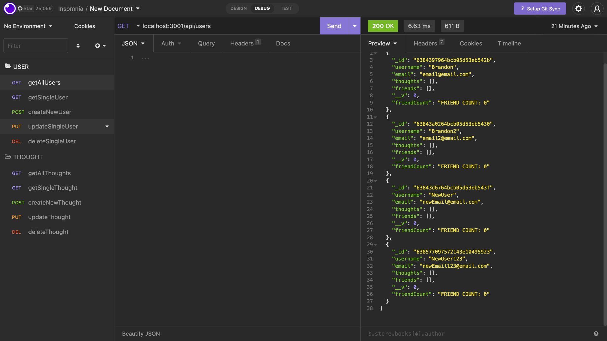

# Social-Network-API
An API for a social network web application where users can share their thoughts, react to friends’ thoughts, and create a friend list.



## Description
An API for a social network web application where users can share their thoughts, react to friends’ thoughts, and create a friend list. This application is a backend project so if you would like to test it out yourself please use Insomnia. 

[Click here](https://drive.google.com/file/d/1p4vcxEHz3FVT16nb7ufPscFFgu3OnHJJ/view) to see the video demonstration.

---
## Instructions
To try the application yourself, you will need to open your terminal and type  
``` 
node server.js 
```

Then using the Insomnia application you can check and run all of the routes.
There are 2 routes in this application USER and THOUGHTS:

For the USER routes: 
``` 
api/users 
```

``` 
api/users/:userID 
```

``` 
api/users/:userId/friends/:friendId 
```

For the THOUGHTS routes:

``` 
api/thoughts 
```

``` 
api/thoughts/:thoughtId 
```

``` 
api/thoughts/thoughtId/reactions 
```

``` 
api/thoughts/thoughtsId/reactions/:reactionId 
```
---
## Credits
- Thank you to the UTA-Bootcamp team.
- The Coding Collective
- Private tutor Scott Everett
---
## License

[](https://opensource.org/licenses/MIT)
---
